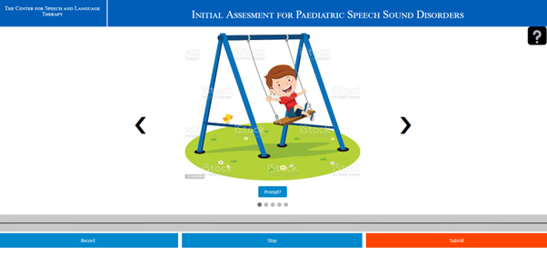

<h1 style = "font-size: 220%"> Paediatric Speech Sound Disorder Diagnosis with Flask and Tensorflow </h1>

This is the supplementary material for the MSc Project - Automatic Detection of Child Speech Sound Disorders using Deep Learning.

| Website Audio Recording Page |

<h1> Paper Abstract </h1>

Paediatric speech sound disorders (SSD) can present themselves in a child of any age and if left untreated they can lead to developmental issues later in life. There is a shortage of Paediatric Speech and Language Therapists (SLT) in the UK and therefore many disordered children are being left untreated. Recent developments in automatic speech recognition, powered by progress in machine learning, have shown that machines are capable of transcribing speech to a high level of accuracy. This paper presents the idea that similar models could be trained to detect errors in speech. To this end I present an application designed to replace the current process of manual SSD diagnosis and by extension reduce the burden on SLT.

This project creates two Spectrogram-CNN based machine learning models trained on the UltraSuite dataset (Eshky et al., 2018). The first model is designed to transcribe a child’s speech phonetically, whilst the second model predicts if a speech sample is likely to be disordered. We achieve accuracies of 77% and 88% for the phoneme and word level models respectively. The word level model is then used in a web front end which serves as a proof of concept for how the model may be implemented to help alleviate some SLT workload. A survey of 15 professional paediatric speech and language therapists demonstrated that the proposed website could not serve as a full replacement of their initial assessment process. But it was suggested that this technology may find use as a screening tool to be used by parents and schools prior to referral to initial assessments. 

<h1> Folder Structure </h1>

## Core Folder:
 Contains the rest of the folders listed below and the app.py python file which defines all the python Flask functionality. The core folder also holds a demonstration video used in the professional survey part of the project. Also listed is a pdf of the survey that was sent to the paediatric SLTs.

## Files folder:
 Contains the standard examples of speech used as the anchor for the Siamese network as well as the recorded mp3 and wav files used in the speech recording functionality

## Model Creation folder: 
 Contains three notebook scripts (.ipynb) that were used to train the word level model used in the website and also the phoneme level model outlined in the dissertation

## Static folder:
 Contains the images used in the website and the CSS styling  
    - The Scripts folder within contains the JavaScript required for the speech recording logic  
    - The models folder contains five 1.61GB files containing the weights of the models trained for each word

## Templates folder:
 Contains the three webpages, index.html, input.html and output.html

<h1> Dependencies and Installation </h1>

The website is not currently live. If you wish to run the code yourself, create a python virtual environment and pip install the following dependencies below. Conflicts may occur if you use more recent TensorFlow and tensorflow_io modules.

pip install os  
pip install flask  
pip install tensorflow==2.30  
pip install tensorflow_io==0.23.1  
pip install subprocess  
pip install numpy  
pip install pandas  

In addition to this, you must also download ffmpeg from https://ffmpeg.org/download.html and add it to your system path, as this is used in the wav file conversion.

Once the environment is set up, you can open the folder directory in command prompt or PowerShell and simply type "flask run", and the website will begin running on port http://127.0.0.1:5000/

Note: line 68 in app.py begins a commented-out for-loop that contains the true functionality of the website. However, running this code can take up to 10 minutes as it loads in each model separately. For all other purposes please use the dummy results list on line 80 for a faster run time. 

Note: The full dataset used for training the models is not in this folder because it is large and publicly available at https://ultrasuite.github.io/

## To run the training notebooks, you must:

- Run them in google colab  
- Download the UXTD and UXSSD datasets by following instructions on https://ultrasuite.github.io/  
- Upload these datasets to a google drive account (this may take some time)  
- Edit the code to suit your own google drive directory

## References For Development
- [Using the MediaRecorder API](https://developer.mozilla.org/en-US/docs/Web/API/MediaRecorder_API/Using_the_MediaRecorder_API): Explains in detail how the Web Dictaphone works.
- [MediaRecorder API landing page](https://developer.mozilla.org/en-US/docs/Web/API/MediaRecorder_API): includes API reference and more
- [Sole](http://soledadpenades.com/) for the oscilloscope code.
- [Slide Show](https://www.w3schools.com/howto/howto_js_slideshow.asp) for the data collection page
- [Video Demo](https://www.youtube.com/watch?v=NHpKqIwbEn0&t=1s) that was used in the professional survey

### Data References
- [UltraSuite Website](https://ultrasuite.github.io/) for data source
- UltraSuite Paper:  Eshky, A., Ribeiro, M. S., Cleland, J., Richmond, K., Roxburgh, Z., Scobbie, J., & Wrench, A. (2018) Ultrasuite: A repository of ultrasound and acoustic data from child speech therapy sessions. Proceedings of INTERSPEECH. Hyderabad, India.
- UltraSuite Labelling Paper: Ribeiro, M. S., Eshky, A., Richmond, K. & Renals, S., (2019). Ultrasound tongue imaging for diarization and alignment of child speech therapy sessions. Proceedings of INTERSPEECH. Graz, Austria.